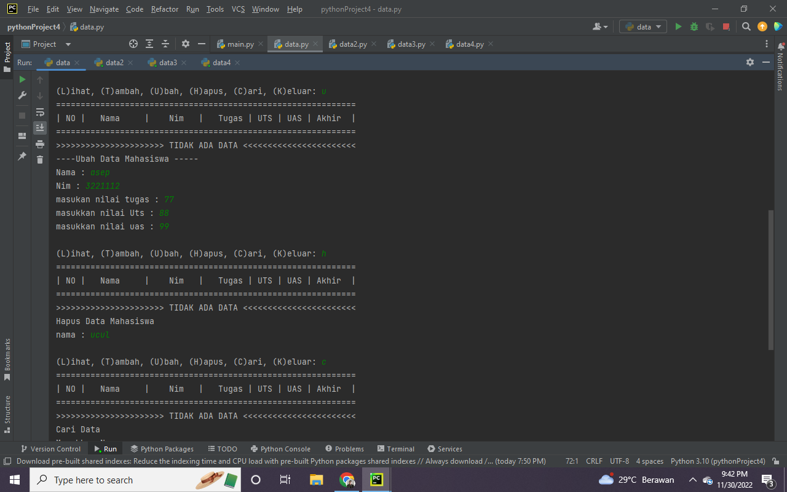

# UAS-Semester1

project UAS Semester 1

Nama : Asep Saepuloh

NIM  : 312210037

Kelas: TI.CI.22

Link Yotube Tutorial Program

PDF Tutorial Program

[klik donngs.pdf](https://github.com/ASEPSAEPULOH21/UAS-Semester1/files/10419152/PDF.Tutorial.UAS-SEMESTER.1.Asep.saepuloh.pdf)

Project UAS

Penjeleasan Program
Untuk membuat Program tersebut pertama buat package yang berisi file seperti dalam ketentuan di atas.

daftar_nilai.py
Pertama saya membuat file daftar_nilai.py yang terletak pada folder model dan berisi beberapa fungsi 
yaitu tambah_data, ubah_data, hapus_data, dan cari_data dan berisi database berupa dictionary

Berikut Code Program daftar_nilai.py

database = {}

def tambah_data(nama,nim,tugas,uts,uas,akhir):
    database[nama] = nama, nim, tugas, uts, uas, akhir

def hapus_data(nama):
        if nama in database.keys():
            del database[nama]
            return True
        else:
            print(f'Data Dengan Nama {nama} Tidak Ditemukan!')
            return False
def ubah_data(nama):
    if nama in database.keys():
        del database[nama]

def cari_data():
    from view.view_nilai import cari
    cari(input("\nMasukan Nama Yang Ingin dicari = "))

input_nilai.py

Selanjutnya saya membuat fungsi untuk meminta user memsaukan data / input yang berada pada file
input_nilai.py yang berada pada modul view dan input user di gabung dengan fungsi yang sudah 
saya buat sebelumnya pada daftar_nilai.py untuk memasukan inputan user ke database(dictionary)
Berikut Code Perogram yang berada pada input_nilai.py

from model.daftar_nilai import tambah_data, ubah_data, hapus_data
from view.view_nilai import cari

def masukan_data():

    print("\n|=========================|")

    print("|  Tambah Data Mahasiswa  |")

    print("|=========================|")

    nama = input("\nMasukan Nama = ")
    nim = int(input("Masukan NIM = "))
    tugas = int(input("Masukan Nilai Tugas = "))
    uts = int(input("Masukan Nilai UTS = "))
    uas = int(input("Masukan Nilai UAS = "))
    akhir = float((0.30 * tugas) + (0.35 * uts) + (0.35 * uas))
    tambah_data(nama,nim,tugas,uts,uas,akhir)

def cari_hapus():
    hapus_data(input("Masukan Nama yang ingin di Hapus = "))

def cari_ubah():
    ubah_data(input("Masukan Nama dari Data yang ingin di Ubah = "))
    print("\n:=====================:")
    print(":  Masukan Data Baru  :")
    print(":=====================:")

    nama = input("\nMasukan Nama = ")
    nim = int(input("Masukan NIM = "))
    tugas = int(input("Masukan Nilai Tugas = "))
    uts = int(input("Masukan Nilai UTS = "))
    uas = int(input("Masukan Nilai UAS = "))
    akhir = float((0.30 * tugas) + (0.35 * uts) + (0.35 * uas))
    tambah_data(nama, nim, tugas, uts, uas, akhir)

    view_nilai.py
Selanjutnya saya membuat fungsi untuk menampilkan semua data yang ada dan fungsi untuk 
menampilkan hasil pencarian user dengan menggunakan modul tabulate data untuk 
mempercantik tabel dan memanggil database(dictionary) yang ada pada modul daftar_nilai.py
Berikut code program view_nilai.py

from model.daftar_nilai import database
from tabulate import tabulate

def tampilkan():
    print(tabulate(database.values(), headers=[
          "Nama", "NIM", "Tugas", "UTS", "UAS", "AKHIR"], tablefmt="double_grid"))

def cari(nama):
    Data_cari = {}
    for key, value in database.items():
        if nama in value:
            Data_cari[key] = value

    print(tabulate(Data_cari.values(), headers=[
          "Nama", "NIM", "Tugas", "UTS", "UAS", "AKHIR"], tablefmt="double_grid"))

main.py

Terakhir saya membuat file main.py yang berisi code program untuk menyatukan semua fungsi 
yang ada di beberapa modul yang telah saya buat sebelumnya dengan mengimport modul dan 
fungsi yang akan saya pakai ke dalam main.py dan saya membuat perulanagn menggunakan py 
while True:  untuk mebuat perulangan pada pilihan menu yang akan tampil sebagai pilihan user.

Berikut Code program main.py

import model
import view
import os

while True:
    print('\n|================|')
    print('|  Pilihan Menu  |')
    print('|================|')
    print('\n1. Tambah Data')
    print('2. Hapus Data')
    print('3. Ubah Data')
    print('4. Cari Data')
    print('5. Lihat Semua Data')
    print('6. Keluar ')

    pilihan = input('\nMasukan Pilihan Menu = ')

    if pilihan == '1':
        view.input_nilai.masukan_data()
    elif pilihan == '2':
        view.input_nilai.cari_hapus()
    elif pilihan == '3':
        view.input_nilai.cari_ubah()
    elif pilihan == '4':
        model.daftar_nilai.cari_data()
    elif pilihan == '5':
        view.view_nilai.tampilkan()
    elif pilihan == '6':
        break
    else:
        print('Masukan Pilihan yang Benar!!')

Hasil Perogram
Tambah Data
Berikut dokumentasi untuk hasil program tambah data

Hapus Data
Berikut dokumentasi untuk hasil program hapus data
sebelum di hapus

Ubah Data
Berikut dokumentasi untuk hasil program ubah data

Cari Data
Berikut dokumentasi untuk hasil program cari data

Tampilkan Semua Data
Berikut dokumentasi untuk hasil program tampilkan semua data

